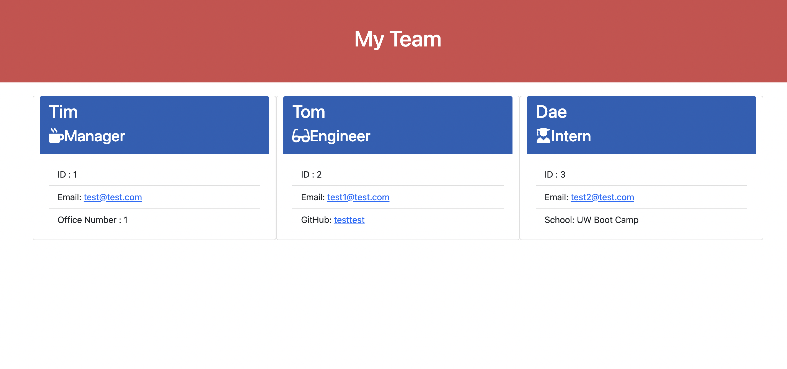

# Team Profile Generator

  ## License
  ------------------
   https://opensource.org/licenses/MIT
  

  ## Table of Contents
  - [Description](#description)
  - [Usage](#usage)
  - [Test](#test)
  - [Github](#github)
  - [Email](#email)
  - [Deployed Link](#deploy)

## Image Preview

## Recorded Video
<a href="https://watch.screencastify.com/v/KpUXECxaPwjuAsylisuk">Recorded Video</a>

##  Description
------------------
- App for Organize and create Profiles for Team Members

##  Usage
------------------
- HTML
- BootStrap
- Javascript
- Font Awesome
- Node path/fs
- NPM inquirer

## Test
------------------
* npm run test
- employee.test.js
- engineer.test.js
- intern.test.js
- manager.test.js

## Contact
------------------
Github account : deashawnogle 
Email : deashawnogle@gmail.com 
Github Repository : <a href="https://github.com/deashawnogle">deashawnogle</a>

## Deployed Link
------------------